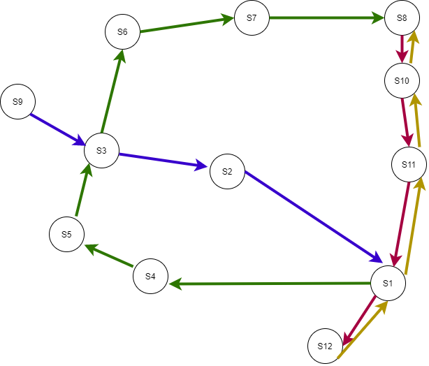

$r$ routes $R_1, R_2, R_3 ... R_r$  
Routes moving from A-B and from B-A are considered separate routes    
$s$ stations $S_1, S_2, ... , S_s$  
At each station $S_x$ we have $r_x$ routes crossing it.  

Each route $R_m$ consists of the stations $\{a, b, c... k\}$ in sequential order and hence the tracks $\{S_{ab}, S_{bc}, S_{cd} ... S_{jk}\}$ in sequential order  

The time taken by train on track from $S_i$ to $S_j$ is bounded by $T_{ij_L}$ to $T_{ij_U}$ i.e. the lower bound to upper bound on time taken i.e. the fastest and lowest it is allowed to move on the track.  

A train running on $S_{hi}$ and $S_{ij}$ should wait atleast $h_i$ time to allow passangers to board.  

Lets inspect the screenshot at time $t$,  

At each station $S_x$, we have $N_{xI}$ and $N_{xO}$ as the number of people incoming and outgoing (leaving) the station.  
Moreover, it will have number of people $n_{x_1},n_{x_2}...,n_{x_{r_x}}$ for each of the routes (the number of people who would be able to board?).  

Let there be $K$ trains available, let $A_1, A_2, ..., A_r$ be the number of trains assigned on each route.  

Let the starting times of trains from the initial stations on the route be $B_i$

## Constraints

1. Number of waiting people 
The number of waiting people who could not board on station $x$, $N_{xI} - N_{xO} - \sum_{rx}{n_{xi}}$ i.e. The number of incoming - number of outgoing - number of passangers who would be successfully able to board on a train. We wish to minimize this number over the network and preferably over each station.  

2. Common track constraints
3. bounds on trains on track
4. minimum waiting time at each station
5. two tracks waiting for each other to transfer people (soft)
6. people inflow outflow
7. constraint representing boarding and deboarding
8. ...

## Control Variables
1. Allocation of number of trains on each track $A_i$  
2. Starting time of train number $i$ on route $r$, $B_{ri}$
3. The waiting times of a train at each station 
4. The duration of travel of train from station $i$ to station $j$ $T_{ij}$ bounded by a lower bound and an upper bound

## TODO
x_{t+1} as x_{t} + influx i.e updating constraints

at time t,
1. if train is standing, half duration would be boarding
if t> train_at_station(start) and t< train_at_start+ boarding_time
    all passangers leaving that station would drop, i.e. changing the train
    capacity and would exit the station
2. if train is standing, half duration would be deboarding
    the capacity at the station would decrease and in train would increase
3. if train is on the track, no person should board that train and on the stations, the capacity to board that train would increase
4. 

